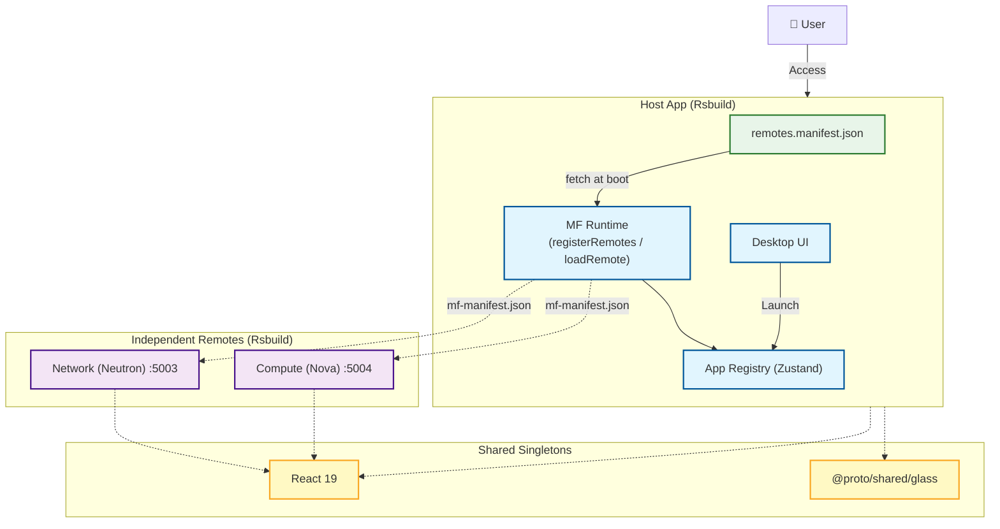

# KBH-Desktop — Web-based Desktop Environment

[](https://github.com/KBH-js/proto/actions/workflows/ci.yml)

브라우저에서 동작하는 데스크탑 환경을 마이크로 프론트엔드 아키텍처로 구현한 인터랙티브 포트폴리오입니다.
사내 실프로젝트(웹 기반 데스크톱 MFE 플랫폼)를 아키텍처와 스펙 기반으로 clean-room 재현했습니다 — 실제 코드는 반출할 수 없으므로, 여기서 보이는 모든 것은 이 레포에서 다시 만들어 실제로 실행됩니다.

**Live Demo:** [proto-six-iota.vercel.app](https://proto-six-iota.vercel.app/)

## Features

- **Window Management** — Zustand 기반 전역 상태로 창 포커스(z-index), 최소화/최대화, 드래그·리사이즈 구현
- **Runtime Micro-Frontends** — Module Federation 2.x 런타임 API로 remote 앱 2개를 동적 등록·로딩. remote 목록은 빌드 타임이 아닌 `remotes.manifest.json`에서 주입되어, manifest 수정만으로 호스트 재배포 없이 remote 추가/이동 가능
- **OpenStack 도메인 Remote** — Network(=Neutron :5003) · Compute(=Nova :5004) 대시보드는 TanStack Query 캐싱·장애 주입, MSW-mockable REST(+인메모리 폴백), 스코프 CSS-변수 토큰(호스트 다크 테마 반응), 호스트 locale/theme 브리지를 갖춘 독립 배포 remote
- **장애 격리 & 복구** — remote 서버 장애 시 해당 창만 에러 상태로 격리. 서버 복구 후 창 안의 **Try Again** 버튼으로 페이지 새로고침 없이 그 창만 복구
- **Rspack 빌드체인** — 호스트/remote 모두 Rsbuild(Rspack) 기반, 호스트는 React Compiler 적용
- **테스트 & CI 게이트** — Vitest+MSW 단위·통합 테스트와 Playwright E2E(창 조작·remote 로드·장애 복구)가 GitHub Actions PR 게이트에서 매 PR마다 실행. 자세한 내용은 [TESTING.md](./TESTING.md)

## Architecture

Host(Desktop)가 부팅 시 manifest를 읽어 Remote(App)들을 런타임에 등록하고, 각 Remote는 독립 배포됩니다.



### Why Module Federation 2.x Runtime?

- **런타임 URL 주입** — remote 위치가 빌드 산출물에 박히지 않아, manifest 편집만으로 remote를 교체·확장
- **장애 격리·복구** — `registerRemotes(..., { force: true })`로 실패한 remote의 컨테이너 캐시를 초기화하고 창 단위로 재시도. 이전(빌드 타임 방식)에는 전체 새로고침이 유일한 복구 수단이었음
- **의존성 공유** — React 등 공통 라이브러리를 Host와 Remote가 싱글톤으로 공유해 중복 번들 제거

## Getting Started

Rsbuild MF 플러그인은 dev 모드에서 remote 컨테이너를 바로 서빙합니다 (build + preview 불필요):

```bash
pnpm install

# Terminal 1: 모든 Remote를 dev 모드로 — :5003 Network, :5004 Compute
pnpm dev:remotes

# Terminal 2: Host — http://localhost:5173
pnpm dev
```

### 장애 복구 데모

1. Network와 Compute 창을 연다 — 둘 다 정상 동작
2. Compute dev 서버를 종료하고 페이지를 새로고침한 뒤 Compute를 연다 → Compute 창만 에러, Network는 정상
3. Compute 서버 재기동 후 에러 창의 **Try Again** 클릭 → 페이지 새로고침 없이 해당 창만 복구

자세한 아키텍처와 remote 추가 절차는 [REMOTES.md](./REMOTES.md)를 참고하세요.

## Tech Stack

| | |
|---|---|
| **코어** |     |
| **UI · 상태** |     |
| **품질 · CI** |     |
