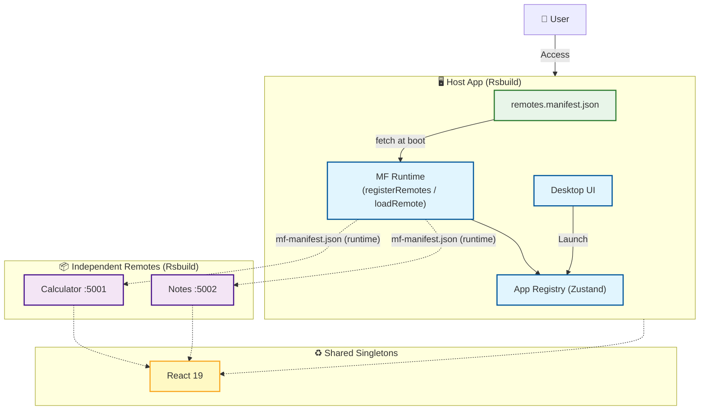

# 🖥️ Web-based Desktop Environment (Micro-Frontends Demo)


> **Live Demo:** [https://proto-six-iota.vercel.app/]

<br><br>

## 🎯 Project Overview
이 프로젝트는 웹 브라우저 상에서 **'데스크탑 경험'**을 제공하는 마이크로 프론트엔드 아키텍처 데모를 **'Clean Room Implementation'** 방식으로 미니멀하게 재구현했습니다.

### 🔑 Key Features
* **Micro-Frontends:** `Module Federation 2.x` 런타임 API로 Calculator, Notes 등 외부 앱을 **런타임에 동적 등록·로딩** — remote 목록은 빌드 타임이 아닌 `remotes.manifest.json`에서 주입
* **장애 격리 & 복구:** remote 서버 장애 시 **해당 창만 에러 상태**로 격리되고, 서버 복구 후 창 안의 "Try Again" 버튼으로 **페이지 새로고침 없이 그 창만 복구**
* **Window Management:** `Zustand` 기반의 전역 상태 관리로 창의 포커스(Z-index), 최소화/최대화, 드래그 앤 드롭 구현
* **Rspack 빌드체인:** 호스트/remote 모두 `Rsbuild(Rspack)` 기반, 호스트는 `React Compiler`(Babel 플러그인) 적용

<br><br>

## 🏗️ Architecture

### Runtime Module Federation Structure
Host(Desktop)가 부팅 시 manifest를 읽어 Remote(App)들을 **런타임에 등록**하고, 각 Remote는 독립 배포됩니다.



<br><br>

## 🚀 Technical Decision

### Why Module Federation 2.x Runtime (instead of build-time remotes)?

* **런타임 URL 주입:** remote URL이 빌드 산출물에 박히지 않음 — manifest 한 줄 수정으로 remote 추가/이동 가능, 호스트 재배포 불필요
* **장애 격리·복구:** `registerRemotes(..., { force: true })`로 실패한 remote의 컨테이너 캐시를 초기화하고 창 단위로 재시도 — 이전(`@originjs` 빌드 타임 방식)에는 전체 새로고침이 유일한 복구 수단이었음
* **의존성 공유:** React 등 공통 라이브러리를 싱글톤으로 공유하여 중복 로드 방지

### Why Rsbuild?

* **Dev 모드 remote 서빙:** 기존 Vite 플러그인은 remote를 매번 `build + preview` 해야 했지만, Rsbuild MF 플러그인은 `dev` 모드에서 바로 컨테이너를 서빙
* **Rspack 기반:** webpack 호환 MF 구현체를 그대로 사용하면서 빌드 속도 확보

<br><br>

## 🤖 AI-Driven Development Log

이 프로젝트는 [PRD 기반 워크플로우](https://github.com/snarktank/ai-dev-tasks)를 활용하여 개발되었습니다. 개발 과정에서 생성된 PRD와 Task 리스트는 `/tasks` 폴더에서 확인하실 수 있습니다.

<br><br>

## 🛠️ Installation & Run

Rsbuild 전환 이후 remote도 **dev 모드로 바로 실행**됩니다 (build + preview 불필요):

```bash
# Terminal 1: 모든 Remote를 dev 모드로 실행 (:5001 Calculator, :5002 Notes)
pnpm dev:remotes

# Terminal 2: Host 실행 (:5173)
pnpm dev
```

개별 실행도 가능합니다:

```bash
cd packages/remote-calculator && pnpm dev   # :5001
cd packages/remote-notes && pnpm dev        # :5002
```

> **Note:** Host와 각 Remote는 별도의 Vercel 프로젝트로 독립 배포됩니다.
> Remote 등록/배포 구조는 [REMOTES.md](./REMOTES.md)를 참고하세요.

### 장애 복구 데모 시나리오

1. Calculator와 Notes 창을 연다 — 둘 다 정상 동작
2. Notes dev 서버를 종료한 뒤 페이지 새로고침 → Notes 창만 에러, Calculator는 정상
3. Notes 서버를 재기동하고 에러 창의 **Try Again** 클릭
4. **페이지 새로고침 없이** 해당 창만 복구되는 것을 확인
