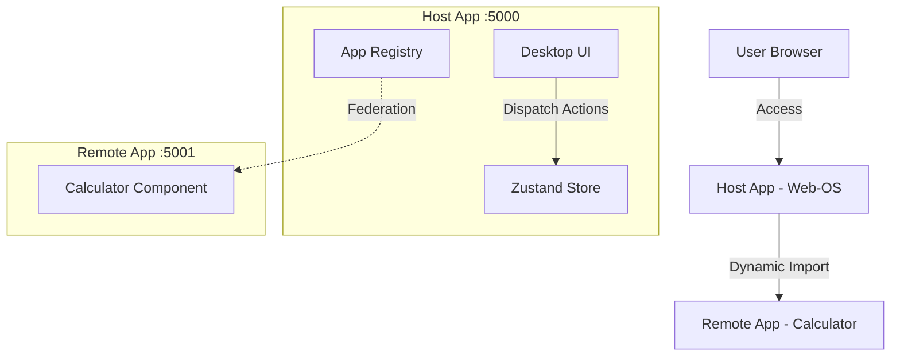

# 🖥️ Web-OS Window Manager (Micro-Frontends Demo)


> **Live Demo:** [https://proto-six-iota.vercel.app/]

## 🎯 Project Overview
이 프로젝트는 웹 브라우저 상에서 **데스크탑 OS 경험(Windowing System)**을 제공하는 마이크로 프론트엔드 아키텍처 데모를 **'Clean Room Implementation'** 방식으로 재구현했습니다.

### 🔑 Key Features
* **Micro-Frontends:** `Module Federation`을 통해 계산기(Calculator) 등 외부 앱을 런타임에 동적으로 로딩
* **Window Management:** `Zustand` 기반의 전역 상태 관리로 창의 포커스(Z-index), 최소화/최대화, 드래그 앤 드롭 구현
* **Clean Architecture:** 비즈니스 로직과 UI 컴포넌트(Window Frame)의 철저한 분리

## 🏗️ Architecture

### Module Federation Structure
Host(OS)와 Remote(App)가 어떻게 독립적으로 배포되고 런타임에 통합되는지 보여줍니다.



## 🚀 Technical Decision

### Why Module Federation?

* **의존성 공유:** React 등 공통 라이브러리를 공유하여 번들 사이즈 최적화
* **심리스한 UX:** iframe의 고질적인 문제(모달 잘림, 통신 복잡도) 해결

## 🤖 AI-Driven Development Log

이 프로젝트는 Cursor를 활용한 Rapid Prototyping 프로세스로 개발되었습니다. 개발 과정에서 생성된 PRD와 Task 리스트는 `/tasks` 폴더에서 확인하실 수 있습니다.

## 🛠️ Installation & Run

Remote 앱은 별도로 빌드 후 서빙해야 합니다:

```bash
# Terminal 1: Build and serve Remote (Calculator)
cd packages/remote-calculator
pnpm build
pnpm preview

# Terminal 2: Build and serve Host
pnpm build
pnpm preview
```

> **Note:** Production에서는 Host와 Remote가 각각 별도의 Vercel 프로젝트로 배포됩니다.