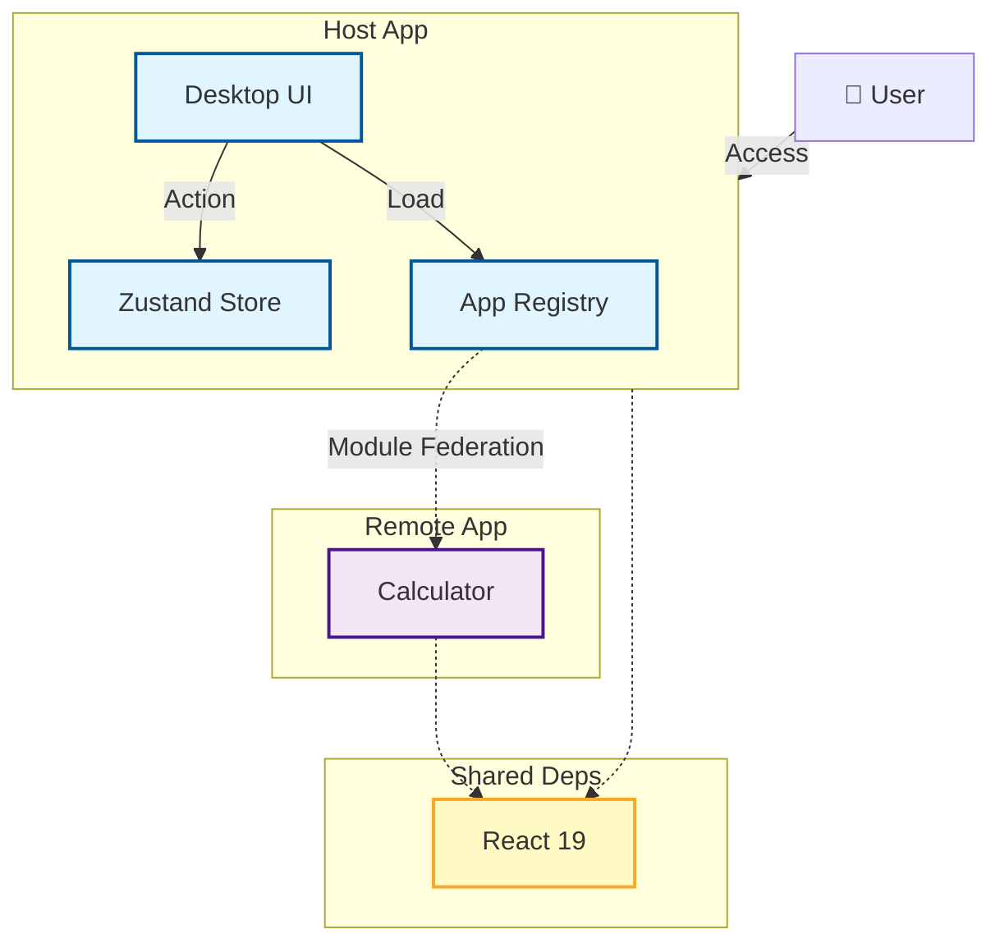

# KBH-Desktop — Web-based Desktop Environment

브라우저에서 동작하는 데스크탑 환경을 마이크로 프론트엔드 아키텍처로 구현한 데모입니다.

**Live Demo:** [proto-six-iota.vercel.app](https://proto-six-iota.vercel.app/)

## Features

- **Window Management** — Zustand 기반 전역 상태로 창 포커스(z-index), 최소화/최대화, 드래그·리사이즈 구현
- **Micro-Frontends** — Module Federation으로 계산기(Calculator) 앱을 런타임에 동적 로딩. Host와 Remote는 별도의 Vercel 프로젝트로 독립 배포

## Architecture

Host(Desktop)와 Remote(App)가 독립적으로 배포되고 런타임에 통합됩니다.



### Why Module Federation?

- **의존성 공유** — React 등 공통 라이브러리를 Host와 Remote가 공유해 중복 번들 제거
- **심리스한 UX** — iframe의 고질적인 문제(모달 잘림, 통신 복잡도) 없이 하나의 화면에 통합

## Getting Started

Module Federation 특성상 Remote는 빌드 후 preview 모드로 서빙해야 하며, Host보다 먼저 실행합니다.

```bash
pnpm install

# Terminal 1: Remote (Calculator) — http://localhost:5001
cd packages/remote-calculator
pnpm build && pnpm preview

# Terminal 2: Host — http://localhost:5173
pnpm dev
```

## Tech Stack

React 19 · TypeScript · Vite · Zustand · Tailwind CSS · @originjs/vite-plugin-federation
